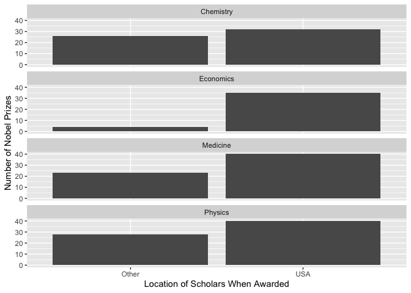
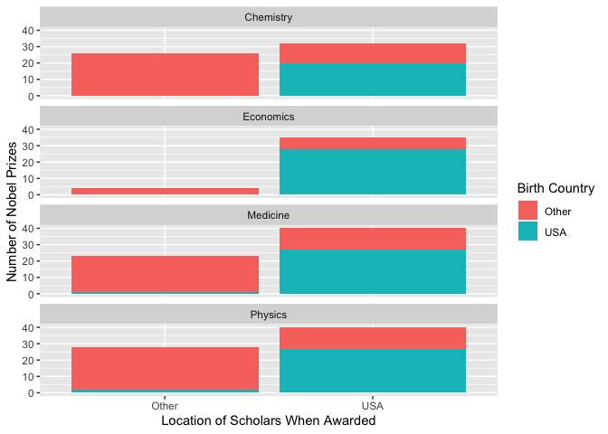

Lab 03 - Nobel laureates
================
Sophie Boyd
1-30-26

### Load packages and data

``` r
library(tidyverse) 
```

``` r
nobel <- read_csv("data/nobel.csv")
```

## Exercises

### Exercise 1

``` r
view(nobel)
```

There are 935 observations of 26 variables. Each row represents one
Nobel prize.

### Exercise 2

``` r
nobel_copy <- nobel

nobel_living <- nobel_copy %>% filter(
  is.na(died_date),
  !is.na(country),
  gender != "org"
  )

view(nobel_living)
```

The new dataset contains 228 observations after filtering for laureates
who are still alive, have available information on ‘country’, and who
are people (not organizations).

``` r
nobel_living <- nobel_living %>%
  mutate(
    country_us = if_else(country == "USA", "USA", "Other")
  )
```

``` r
nobel_living_science <- nobel_living %>%
  filter(category %in% c("Physics", "Medicine", "Chemistry", "Economics"))
```

### Exercise 3

``` r
ggplot(data = nobel_living_science, aes(x = country_us)) +
  geom_bar() +
labs(x = "Location of Scholars When Awarded",
       y = "Number of Nobel Prizes",
     ) +
facet_wrap(~ category, nrow = 4) +
  coord_flip()
```

<!-- -->

The plots support the claim in the Buzzfeed article. In each category,
there is a higher number of Nobel prizes awarded to scholars in the US
than in other countries. The difference is especially stark for prizes
in economics.

### Exercise 4

``` r
nobel_living_science <- nobel_living_science %>%
  mutate(
    born_country_us = if_else(born_country == "USA", "USA", "Other")
  )

nobel_living_science %>%
  count(born_country_us, sort = TRUE)
```

    ## # A tibble: 2 × 2
    ##   born_country_us     n
    ##   <chr>           <int>
    ## 1 Other             123
    ## 2 USA               105

105 winners were born in the US.

### Exercise 5

``` r
ggplot(data = nobel_living_science, aes(x = country_us,
                                                fill = born_country_us)) +
  geom_bar() +
labs(x = "Location of Scholars When Awarded",
       y = "Number of Nobel Prizes",
     fill = "Birth Country"
     ) +
facet_wrap(~ category, nrow = 4) +
coord_flip()
```

<!-- -->

The plots again seem to support the claims in the the Buzzfeed article.
Most of the US-based Nobel laureates were born in the US, but there are
still sizable groups of Nobel laureates who were awarded in the US but
were born in other countries.

### Exercise 6

``` r
nobel_living_science %>%
  filter(country == "USA") %>%
  filter(born_country != "USA") %>%
  count(born_country, sort = TRUE)
```

    ## # A tibble: 21 × 2
    ##    born_country       n
    ##    <chr>          <int>
    ##  1 Germany            7
    ##  2 United Kingdom     7
    ##  3 China              5
    ##  4 Canada             4
    ##  5 Japan              3
    ##  6 Australia          2
    ##  7 Israel             2
    ##  8 Norway             2
    ##  9 Austria            1
    ## 10 Finland            1
    ## # ℹ 11 more rows

Germany and the United Kingdom are the most common birth countries.
